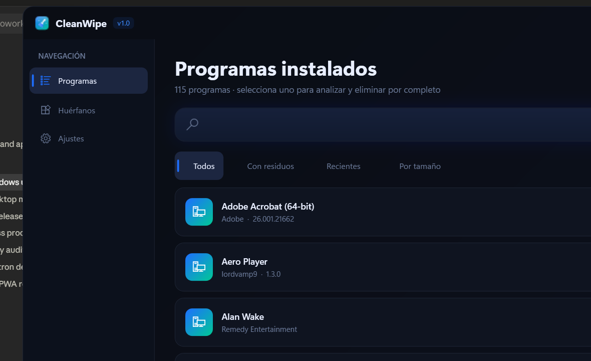

<div align="center">


# 🧹 CleanWipe

**Desinstalador inteligente para Windows** — elimina el 100 % de los rastros de las
aplicaciones de usuario (archivos, carpetas, registro, accesos directos, servicios y
tareas) de forma **segura**, sin tocar componentes del sistema operativo.

Hecho por **vamp9** · Andrés Loyola


-00C896)

</div>

---



## ✨ ¿Qué hace?

El desinstalador nativo de Windows suele dejar basura: carpetas en `%AppData%`,
claves de registro huérfanas, accesos directos rotos y servicios olvidados.
**CleanWipe** detecta y elimina esos rastros de forma controlada y transparente.

- 🔍 **Detección completa** de programas instalados (registro `Uninstall`, WMI y Appx).
- 🧠 **Análisis pre-desinstalación**: muestra en un árbol todo lo que se va a borrar
  (carpetas, registro, archivos, accesos directos, servicios, tareas) con su tamaño.
- ✅ **Control total**: marca/desmarca cada ítem antes de limpiar.
- 🛡️ **Seguridad primero**: un validador obligatorio impide tocar rutas del sistema.
- 🗑️ **Modo seguro**: opción de enviar a la Papelera en lugar de borrado directo.
- 🧾 **Reportes** exportables en JSON/TXT de cada desinstalación.
- 🩹 **Escáner de huérfanos**: encuentra basura de programas ya desinstalados.

## 🛡️ Seguridad (lo más importante)

Toda operación de borrado pasa **obligatoriamente** por `SafetyValidator`, que:

- Bloquea `C:\Windows`, `System32`, `SysWOW64`, `WinSxS`, `Boot`, `$Recycle.Bin`,
  `ProgramData\Microsoft`, etc. **y todos sus descendientes**.
- Protege las carpetas/claves raíz del usuario (`AppData`, `Documents`, `Program Files`,
  `...\Uninstall`) permitiendo borrar **solo** la subcarpeta/subclave del programa.
- Normaliza rutas con `GetFullPath` para neutralizar trucos de *path traversal* (`..\..`).
- Protege colmenas críticas del registro (`HKLM\SYSTEM`, `Windows NT`, `.NETFramework`…).

> 46 pruebas unitarias cubren exclusivamente estas reglas de seguridad. Son la red de
> seguridad de CleanWipe y deben pasar siempre.

La app se ejecuta como **usuario normal** (`asInvoker`), sin pedir UAC para operaciones
de usuario. Los archivos en uso se programan para eliminación al reiniciar
(`MoveFileEx`) en lugar de forzarse.

## 🏗️ Arquitectura

```
CleanWipe/
├── src/
│   ├── CleanWipe.App/     → WPF (MVVM): vistas, estilos, animaciones, navegación
│   ├── CleanWipe.Core/    → Lógica de negocio (sin dependencias de UI)
│   │   ├── Models/        → InstalledProgram, TraceItem, ScanResult, UninstallReport
│   │   └── Services/      → ProgramDetector · TraceScanner · SafetyValidator
│   │                        UninstallEngine · RegistryCleaner · FileCleaner
│   │                        OrphanScanner · ReportGenerator · AppLogger
│   └── CleanWipe.Tests/   → xUnit (pruebas críticas de SafetyValidator)
└── assets/                → iconos, logo y capturas
```

- **MVVM** estricto con `CommunityToolkit.Mvvm` (sin lógica en code-behind).
- Operaciones de E/S **async/await** con `CancellationToken` e `IProgress<T>`.
- Logging estructurado con **Serilog** en `%APPDATA%\CleanWipe\logs`.

## 🚀 Compilar y ejecutar

Requisitos: **.NET 8 SDK o superior** (probado con .NET 10) en Windows 10/11.

```powershell
# Clonar
git clone https://github.com/lordvamp9/unistaller.git
cd unistaller

# Ejecutar en desarrollo
dotnet run --project src/CleanWipe.App

# Ejecutar las pruebas de seguridad
dotnet test

# Publicar un .exe único y autocontenido (no requiere .NET instalado)
dotnet publish src/CleanWipe.App -c Release -r win-x64 `
  --self-contained true `
  -p:PublishSingleFile=true -p:IncludeNativeLibrariesForSelfExtract=true
```

El ejecutable final se publica en
`src/CleanWipe.App/bin/Release/net10.0-windows/win-x64/publish/CleanWipe.exe`
y también está disponible en la sección **[Releases](https://github.com/lordvamp9/unistaller/releases)**.

## 🎨 Stack

`C# · .NET 10 · WPF · MVVM · CommunityToolkit.Mvvm · Serilog · Newtonsoft.Json · WMI`

## 📄 Licencia

CleanWipe se publica bajo la **Licencia CleanWipe (vamp9)** — software libre y de acceso
público. Puedes usarlo, estudiarlo, modificarlo y compartirlo gratuitamente **conservando
la atribución a vamp9**. Está **prohibido venderlo o presentarlo como obra propia**.
Consulta el archivo [LICENSE](LICENSE) para el texto completo.

---

<div align="center">
hecho con 💙 por <b>vamp9</b>
</div>
